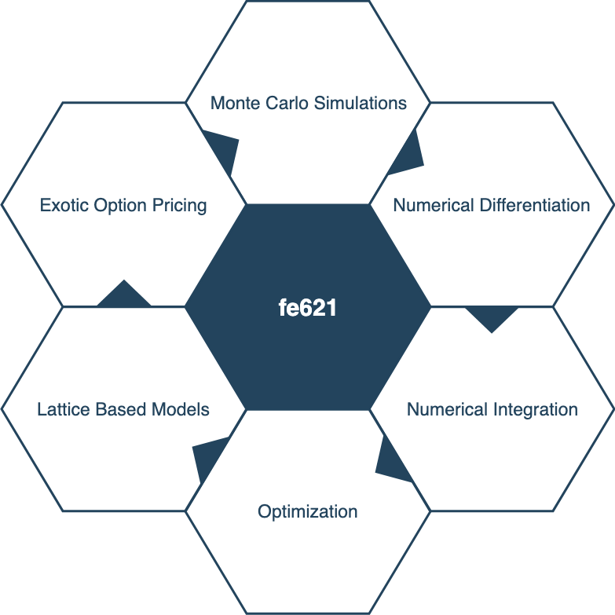

# FE 621 Homework

    

Repository to store homework for FE 621 (Computational Methods in Finance) taught by Professor Ionut Florescu at the Steven Institute of Technology in Spring Semester 2019.

## Functionality Overview

### Black Scholes Model Pricing (Analytical)

- Asian (i.e. average value) Equity Options: https://github.com/rukmal/FE-621-Homework/tree/master/fe621/black_scholes/asian
- Barrier Equity Options: https://github.com/rukmal/FE-621-Homework/tree/master/fe621/black_scholes/barrier
- Vanilla Equity Options: https://github.com/rukmal/FE-621-Homework/tree/master/fe621/black_scholes
- Vanilla Greeks: https://github.com/rukmal/FE-621-Homework/blob/master/fe621/black_scholes/greeks.py
- Vanilla Parity: https://github.com/rukmal/FE-621-Homework/blob/master/fe621/black_scholes/parity.py

### Monte Carlo Simulations

*Note: All option pricing functions are under the Black Scholes model heuristic.*

- General Simulation Driver: https://github.com/rukmal/FE-621-Homework/blob/master/fe621/monte_carlo/monte_carlo.py
- Simple Geometric Brownian Motion Equity Option Pricing: https://github.com/rukmal/FE-621-Homework/blob/master/fe621/monte_carlo/option_pricing/simple_gbm.py
- Delta-Based Control Variates Method Variance-Reduced Equity Option Pricing: https://github.com/rukmal/FE-621-Homework/blob/master/fe621/monte_carlo/option_pricing/control_variates.py
- Antithetic Variates Method Variance-Reduced Equity Option Pricing: https://github.com/rukmal/FE-621-Homework/blob/master/fe621/monte_carlo/option_pricing/antithetic_variates.py
- Antithetic Variates Delta-Based Control Variates Method Variance-Reduced Equity Option Pricing: https://github.com/rukmal/FE-621-Homework/blob/master/fe621/monte_carlo/option_pricing/antithetic_control_variates.py

### Numerical Differentiation/Integration

- Numerical Differentiation: https://github.com/rukmal/FE-621-Homework/tree/master/fe621/numerical_differentiation
- Numerical Integration: https://github.com/rukmal/FE-621-Homework/tree/master/fe621/numerical_integration

### Optimization (Numeric; 1D)

- Bisection Method: https://github.com/rukmal/FE-621-Homework/blob/master/fe621/optimization/bisection.py
- Newton's Method: https://github.com/rukmal/FE-621-Homework/blob/master/fe621/optimization/newton.py

### Lattice Based (Tree) Pricing Models

*Note: All option pricing functions are under the Black Scholes model heuristic.*

- General Tree Driver: https://github.com/rukmal/FE-621-Homework/blob/master/fe621/tree_pricing/general_tree.py
- Binomial Trigeorgis Additive Vanilla Option Pricing: https://github.com/rukmal/FE-621-Homework/blob/master/fe621/tree_pricing/binomial/trigeorgis.py
- Binomial Trigeorgis Additive Barrier Option Pricing: https://github.com/rukmal/FE-621-Homework/blob/master/fe621/tree_pricing/binomial/barrier.py
- Trinomial Additive Vanilla Option Pricing: https://github.com/rukmal/FE-621-Homework/blob/master/fe621/tree_pricing/trinomial/trinomial_price.py

